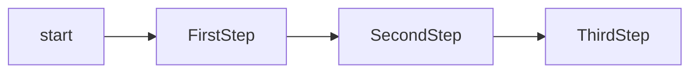
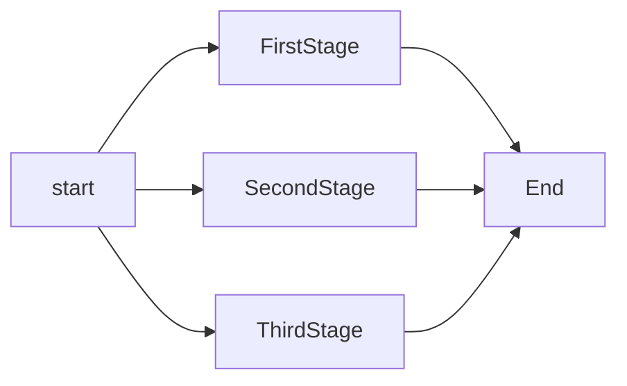
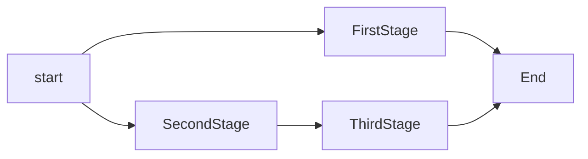
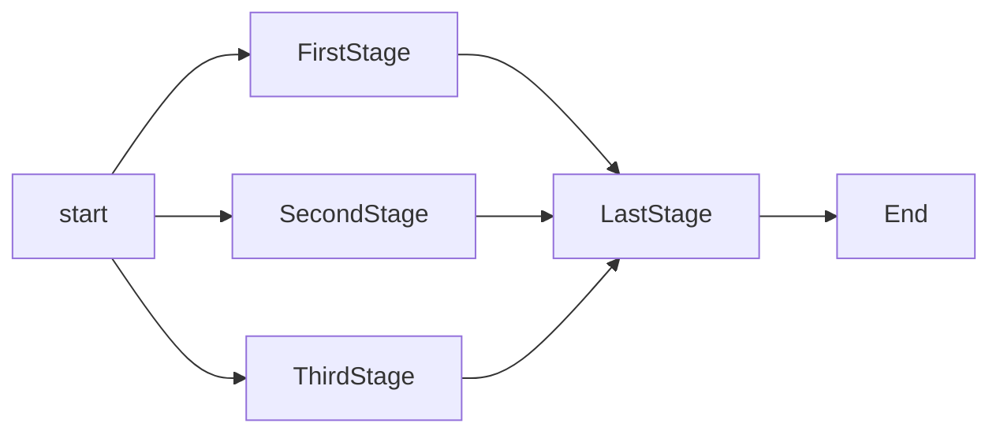

# CI Mage
CI Mage is a tool for generating build scripts that target different build servers

## Why?
Most modern CI servers use some flavor of YAML to have the user define their builds. This
approach, while ubiquituous, has several disadvantages:
- YML lacks the expressiveness of a programming language, which makes reading the build scripts hard
- The various solutions all use their own YML flavour, which makes switching tools harder
- In situations where multiple build tools are used several scripts will need maintenance leading
  to increased effort.

Enter CI Mage:
* Use C# to declare your build pipelines, with the full expressiveness of a
statically typed language.
* Target multiple CI runners, such as GitHub, GitLab, Azure DevOps and Local
* Have multiple environments to target different instances of the same runner type
* Execute the full build locally

## Terminology
Since most of our targets use similar but not quite the same terminology for their concepts an overarching set of terms is required to define the concepts used by ci-mage:

* Job: A job is a top level entity used to group several build steps.
* Step: A step is an entity that is used to group tasks that run in parallel
* Task: A task is the smalles part of a build. It can be part of a step or run on its own.
* Artifact: An artifact is a collection of build products, that can be consumed by other build tasks
* Agent: An agent is an entity which can be used to offload work to

Map of concepts to target systems:

| Concept  | AzureDevops | Gitlab | Local |
|----------|-|-|-|
| Job      |-|-| "Batch"*|
| Step     |-| Stage | "Thread"* |
| Task     |-|-| "Batch"*|
| Artifact  |Artifact | Artifact | "Zip"*|
| Agent    |-|-| "Thread"*|


## Simple Idea
```csharp
    void build(Builder b)
    {
        b.job( context => {

            context.step("First Step", step_context => {                
                step_context.task( (task_context) => ctx.sh("echo \"Hello from Step 1\"");
            });

            context.step("Second Step", step_context => {
                step_context.task( (task_context) => ctx.sh("echo \"Hello from Step 2\"");
            });

            context.step("Third Step", step_context => {
                step_context.task( (task_context) => ctx.sh("echo \"Hello from Step 3\"");
            }));
        } );

    }
```

The above would create a build with three sequential steps, each containing a single task



Parallel stages
```csharp
    void build(Builder b)
    {
        b.job( context => {
            
            context.stage("First Stage", stage_context => {                
                stage_context.sh("echo \"Hello World \" ")
            });

            context.stage("Second Stage", stage_context => {
                stage_context.sh("echo \"I Am stage two \" ")
            });

            context.stage("Third Name", stage_context => {
                stage_context.sh("echo \"I Am stage three \" ")
            });
        } );

    }
```
The above will create stages that run in parallel, i.e. the resulting
build graph would be:


Mixed:
```csharp
    void build(Builder b)
    {
        b.job( context => {
            
            context.stage("Stage Name", stage_context => {                
                stage_context.sh("echo \"Hello World \" ")
            });

            context.stage("Second Stage", stage_context => {
                stage_context.sh("echo \"I Am stage two \" ")
            }).andThen( () => 
                context.stage("Stage Name", stage_context => {
                    stage_context.sh("echo \"I Am stage three \" ")
            }));
        } );

    }
```
The above will execute the first and second stage in parallel and
the last one after the second stage completes.
, i.e. the resulting build graph would be:



Syncronizing parallel stages
```csharp
    void build(Builder b)
    {
        b.job( context => {
            
            context.stage("First Stage", stage_context => {                
                stage_context.sh("echo \"Hello World \" ")
            });

            context.stage("Second Stage", stage_context => {
                stage_context.sh("echo \"I Am stage two \" ")
            });

            context.stage("Third Name", stage_context => {
                stage_context.sh("echo \"I Am stage three \" ")
            });
        } ).andThen(
            context => {
            context.stage("LastStage", stage_context => {
                stage_context.sh("echo \"I Am stage three \" ")
            });
        });

    }
```



## Multiple jobs
Call the "job" function several times to create mutliple jobs:
```csharp
    void build(Builder b)
    {
        b.job( /*..*/ );
        b.job( /*..*/ );
    }
```

## Using variables
Most tools will expose a set of global variables containing informations on the
build. Further we can usually define variables ourselves.

Existing Globals

* CommitId:   Contains the commit ID  that is being built
* UserId:     Contains an applicable form of user id of the user that triggered the build
* AgentName:  Contains the name of the agent on which we are running

To use a variable add it in braces into any output value. When the script is rendered, 
the variable occurences will be used correctly. E.g.:
```csharp
    context.sh("echo \"Commit id is {CommitId}\"");
```

For gitlab this will be rendered as:
`echo "Commit id is ${CI_COMMIT_SHA}"`

## Defining variables
Variables can be defined as well:
```csharp
    context.var("VarName", "VarValue")
```

Rules when resolving variables:
* When the script is rendered, variables are resolved in reverse order of their declaration, i.e.:
    * At first variables declared on the stage are resolved
    * Then variables declared on the context
    * Then variables on the builder

## Artifacts
Artifacts are created in the context of a stage:
```csharp
context.stage("Stage Name", stage_context => {                
        stage_context.sh("echo \"Hello World \" ")
        stage_context.artifact("ArtifactName", "./build/*.*")
});
``` 

The above will create the artifact `ArtifactName` from all files in `./build`. The artifact is then available for later jobs to consume. Note, that the generator will enforce, that artifacts are in fact available for the stage that wants to consume them, i.e.the artifacts must be generated in an earlier stage of the build.

Using an artifact is as simple as calling `useArtifact` on the stage context:
```csharp
context.stage("Stage Name", stage_context => {                
        stage_context.sh("echo \"Hello World \" ")
        stage_context.useArtifact("ArtifactName")
});
``` 

## Agents
An agent is a build node, i.e. a computer / virtual machine that is used to offload the heavy lifting of the build. Most build systems support the idea of agents (although they all use different names for the same concept).
Agents may either have names or tags or both. (Note: In azure parlance tags are mapped to "demands"!)

Using an agent
```csharp
    void build(Builder b)
    {
        b.withAgent("AgentName").build(
            /*..*/
        )

        b.withTaggedAgent("AgentTag1", "AgentTag2" ...).build(
            /*...*/
        )
    }
```

Note: Since agents are specific to the target infrastructure and not directly visible to the build scripts the correct use of agents cannot be determined by the script generator.

## Containers
If OCI containers are to be used these can be injected as well. Images can be set on a per job name:
```csharp
    void build(Builder b)
    {
        b.withContainer("ContainerName").job(context => {
            
            context.stage("First Stage", stage_context => {                
                stage_context.sh("echo \"Hello World \" ")
            });

            context.stage("Second Stage", stage_context => {
                stage_context.sh("echo \"I Am stage two \" ")
            });

            context.stage("Third Name", stage_context => {
                stage_context.sh("echo \"I Am stage three \" ")
            });
        } ).andThen(
            context => {
            context.stage("LastStage", stage_context => {
                stage_context.sh("echo \"I Am stage four \" ")
            });
        });

    }
```
-> Containers can be set on agetns as well:
 `b.withAgent("AgentName").withContainer("ContainerName").job(/*..*/)`

## Triggers
If a given job is supposed to run on a trigger the `withTrigger` function can be used:
```csharp
    void build(Builder b)
    {
        // Triggers, if the branchname matches a regex
        b.withTrigger(TriggerType.BranchRegex, "ARegex").job(context => {
            );

        // Triggers upon creation of a merge request
        b.withTrigger(TriggerType.MergeRequest).job(context => {
            );
    }
```

The `withTrigger` function is compatible with the `withAgent` and `withContainer` function, however it must always be first.

Note: Jobs without trigger will run on all checkins!

## Build system specific code
Since we have to abstract the idiosyncracies of the build system away there'll always be instances, where we need to inject specific code for a given build system. To do that, we can query the build system on all context-like objects with the `getBuildSystemType()` method. Further we can inject verbatim code as well, e.g.:
```csharp
    void build(Builder b)
    {
        b.job( context => {
            
            context.stage("First Stage", stage_context => {                                
                stage_context.sh("echo \"Hello World \" ")
                if (stage_context.getBuildSystemType() == BuildSystem.AzureDevops)
                {
                    stage_context.sh("echo \"Hello from AzureDevops \" ")
                    stage_context.verbatim("Insert Code here")
                }
            });

        });

    }
```

Note that the verbatim statement will use the formatting as provided by the parameter. This is done due to the way YML treats whitespace. Using the verbatim instruction will therefore require care and should only be done if no better solution exists.